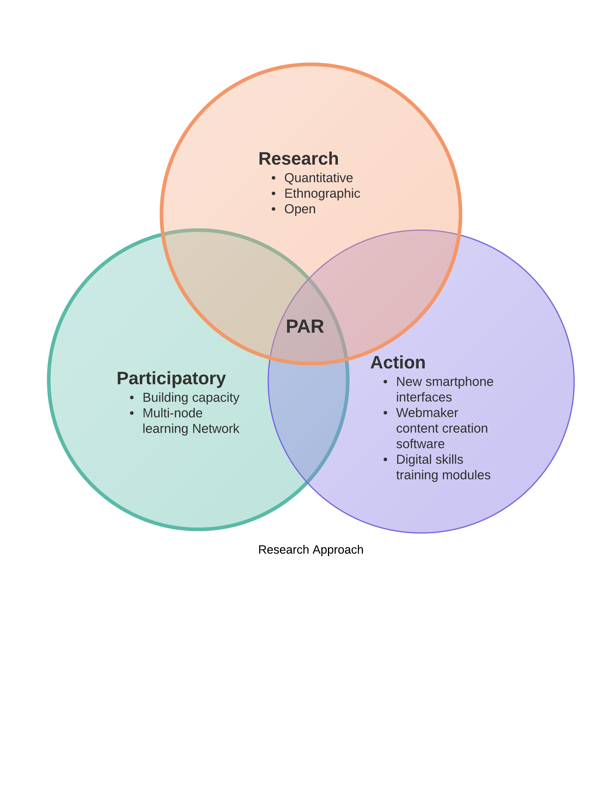

## Digital Skills Observatory Project
A year long experimental research project in Kenya, during which we will follow 150 first-time smartphone users to observe their technology and data usage patterns with respect to consumption, digital financial services, and digital skills. For a portion of participants, several *interventions* are planned throughout the year to introduce curriculum and software prototypes that will guide learning and adoption.

To learn more, check out mzl.la/dso and our research blog. 

### Project Overview
! [Project Overview] (DSO simplified - New Page.png) 
### Research Approach

